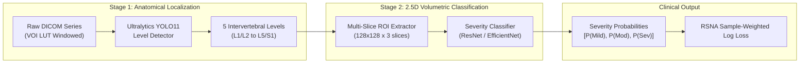

# Lumbar Spine Degenerative Classification using Ultralytics YOLO11 & 2.5D Volumetric CNNs

[](https://www.python.org/)
[](https://docs.ultralytics.com/)
[](https://pytorch.org/)
[](https://opensource.org/licenses/MIT)

An end-to-end, medical-grade deep learning pipeline for detecting, localizing, and grading the severity of lumbar spine degenerative conditions from multi-plane MRI scans. Developed for the **RSNA 2024 Lumbar Spine Degenerative Classification Challenge**.

---

## 📌 Overview & Clinical Significance

Low back pain is the single leading cause of disability worldwide. While Magnetic Resonance Imaging (MRI) is the diagnostic gold standard, manual review of multi-plane 3D volumetric series (Sagittal T1, Sagittal T2/STIR, Axial T2) across all lumbar disc levels is time-consuming and prone to inter-radiologist variability.

This repository implements a **decoupled two-stage architecture** to automatically localize disc levels and classify pathological severity (**Normal/Mild**, **Moderate**, or **Severe**) across five lumbar levels ($L_1/L_2$ to $L_5/S_1$) for three conditions:
1. **Spinal Canal Stenosis (SCS)** — Imaged via **Sagittal T2 / STIR**
2. **Neural Foraminal Narrowing (NFN)** — Imaged via **Sagittal T1**
3. **Subarticular Stenosis (SS)** — Imaged via **Axial T2**

---

## 🏗️ Architecture: Decoupled Two-Stage Pipeline

Instead of forcing a single bounding-box model to predict positions, levels, and rare 30-class severe combinations simultaneously, we decouple the challenge into two specialized stages:



### 1. Stage 1: Disc Level Localizer (Ultralytics YOLO11)
* Trained exclusively on the 5 anatomical disc levels ($L_1/L_2 \dots L_5/S_1$).
* Employs **YOLO11** (`yolo11s.pt`) with **C3k2** feature aggregation and **C2PSA** spatial attention, achieving robust landmark detection ($>90\%$ mAP) without class imbalance dilution.

### 2. Stage 2: 2.5D Multi-Slice Severity Classifier
* For each localized level, extracts a cropped volumetric region of interest ($128 \times 128 \times 3$) centered at the key slice with adjacent neighbor slices.
* Incorporates inter-slice 3D spatial context and outputs class probability vectors $[P(\text{Normal/Mild}), P(\text{Moderate}), P(\text{Severe})]$.
* Directly optimized using the official **RSNA 2024 Sample-Weighted Multi-class Log Loss** (weighting Severe cases $4\times$ and Moderate cases $2\times$).

---

## 📁 Repository Structure

```
Lumbar-Spine-Degenerative-Classification-using-YOLO/
├── README.md                      # Project documentation and portfolio showcase
├── requirements.txt               # Pinned Python dependencies (Ultralytics >= 8.3.0)
├── .gitignore                     # Ignores weights, datasets, and environment credentials
├── .env.example                   # Environment credential template
│
├── configs/                       # Dataset configurations
│   ├── yolo_levels.yaml           # Stage 1: 5-level anatomical disc localizer
│   ├── yolo_nfn.yaml              # Single-stage: Neural Foraminal Narrowing (30 classes)
│   ├── yolo_scs.yaml              # Single-stage: Spinal Canal Stenosis (15 classes)
│   └── yolo_ss.yaml               # Single-stage: Subarticular Stenosis (30 classes)
│
├── src/                           # Modular Python package
│   ├── __init__.py
│   ├── data/
│   │   ├── __init__.py
│   │   ├── dicom_reader.py        # VOI LUT windowing, MONOCHROME1/2, volume loader
│   │   └── dataset_builder.py     # Coordinate mapping & 2.5D multi-slice ROI extractor
│   ├── models/
│   │   ├── __init__.py
│   │   ├── yolo_detector.py       # SpineLevelDetector (YOLO11 wrapper)
│   │   └── severity_classifier.py # LumbarSeverityClassifier (2.5D multi-slice CNN)
│   ├── metrics/
│   │   ├── __init__.py
│   │   └── competition_loss.py    # Official RSNA 2024 Weighted Log Loss (PyTorch & NumPy)
│   └── pipeline/
│       ├── __init__.py
│       └── predict_study.py       # End-to-end inference CLI from raw DICOM to report JSON
│
├── tests/
│   └── test_pipeline.py           # Automated unit tests for data, models, and metrics
│
├── lsdc-train-yolo-nfn.ipynb      # Training pipeline for Neural Foraminal Narrowing (YOLO11)
├── lsdc-train-yolo-scs.ipynb      # Training pipeline for Spinal Canal Stenosis (YOLO11)
└── lsdc-train-yolo-ss.ipynb       # Training pipeline for Subarticular Stenosis (YOLO11)
```

---

## 🛠️ Getting Started

### 1. Installation
```bash
git clone https://github.com/Sentientbee/Lumbar-Spine-Degenerative-Classification-using-YOLO.git
cd Lumbar-Spine-Degenerative-Classification-using-YOLO

# Create and activate virtual environment
python -m venv venv
source venv/bin/activate  # On Windows: .\venv\Scripts\activate

# Install dependencies
pip install -r requirements.txt
```

### 2. Configure Credentials (Optional)
Copy `.env.example` to `.env` to enable experiment tracking:
```bash
cp .env.example .env
```

```env
COMET_API_KEY=your_comet_api_key_here
COMET_PROJECT_NAME=lsdc-sip
WANDB_API_KEY=your_wandb_api_key_here
```

### 3. Run Automated Unit Tests
```bash
python -m unittest tests/test_pipeline.py
```

### 4. Run End-to-End Inference CLI
To run full-study automated diagnosis on a raw DICOM series directory:
```bash
python -m src.pipeline.predict_study \
    --series_dir path/to/study/series \
    --yolo_weights yolo11s.pt \
    --output_json diagnosis_report.json
```

Sample output:
```
=======================================================
           LUMBAR SPINE DIAGNOSIS SUMMARY           
=======================================================
Level L1_L2  | Severity: Normal/Mild | P(Mild)=0.91 P(Mod)=0.07 P(Sev)=0.02
Level L2_L3  | Severity: Normal/Mild | P(Mild)=0.84 P(Mod)=0.13 P(Sev)=0.03
Level L3_L4  | Severity: Moderate    | P(Mild)=0.21 P(Mod)=0.72 P(Sev)=0.07
Level L4_L5  | Severity: Severe      | P(Mild)=0.05 P(Mod)=0.25 P(Sev)=0.70
Level L5_S1  | Severity: Moderate    | P(Mild)=0.18 P(Mod)=0.69 P(Sev)=0.13
=======================================================
```

---

## 🔬 Medical Imaging & Preprocessing Details

* **VOI LUT Windowing:** Reads native `WindowCenter` and `WindowWidth` tags to preserve soft-tissue contrast within the spinal canal and neural foramina.
* **Rescale Intercept & Slope:** Corrects raw pixel stored values to Hounsfield/MRI intensity units ($I = m \times V + b$).
* **Photometric Interpretation:** Auto-inverts `MONOCHROME1` to `MONOCHROME2` to guarantee standard dark-to-light representation across imaging vendors (GE, Siemens, Philips).
* **Multi-Slice ROI Extraction:** Slices $\pm 1$ around the key landmark slice are extracted, preserving continuity across volumetric acquisitions.

---

## 📊 Competition Metric: RSNA Sample-Weighted Log Loss

The evaluation metric reflects clinical urgency by heavily penalizing misclassified severe cases:

$$\mathcal{L} = -\frac{1}{\sum w_i} \sum_{i=1}^N w_i \log(p_{i, y_i})$$

| Severity | RSNA Sample Weight | Clinical Meaning |
| :--- | :---: | :--- |
| **Normal/Mild** | $1.0\times$ | Asymptomatic or non-operative condition |
| **Moderate** | $2.0\times$ | Partial stenosis; requires clinical monitoring |
| **Severe** | $4.0\times$ | Critical canal/foraminal compression; surgical candidate |

---

## 📜 License
This project is licensed under the MIT License - see the LICENSE file for details.
